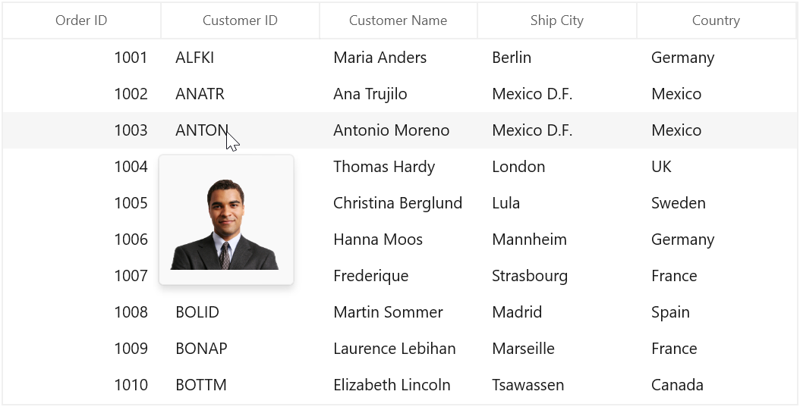

# How to Customize the Tooltip using DataTemplate in WinUI DataGrid?

This repository explains how to customize the tooltip using DataTemplate in [WinUI DataGrid](https://www.syncfusion.com/winui-controls/datagrid) (SfDataGrid).

You can customize the appearance of the ToolTip for particular column by setting `GridColumn.ToolTipTemplate`. And you can also customize the appearance of header ToolTip for particular column by [GridColumn.HeaderToolTipTemplate](https://help.syncfusion.com/cr/winui/Syncfusion.UI.Xaml.Grids.GridColumnBase.html#Syncfusion_UI_Xaml_Grids_GridColumnBase_HeaderToolTipTemplate) property.

#### XAML

``` xml
<Application.Resources>
    <local:StringToImageConverter x:Key="imageConverter" />        
    <DataTemplate x:Key="templateToolTip">
        <Image Height="100" Width="100" Source="{Binding CustomerID,Converter={StaticResource imageConverter}}" />
    </DataTemplate>
</Application.Resources>


<dataGrid:SfDataGrid.Columns>
    <dataGrid:GridNumericColumn HeaderText="Order ID"  ShowToolTip="True" MappingName="OrderID" />
    <dataGrid:GridTextColumn HeaderText="Customer ID" ToolTipTemplate="{StaticResource templateToolTip}" ShowToolTip="True" MappingName="CustomerID" />
</dataGrid:SfDataGrid.Columns>
```

#### C#

``` csharp
public class StringToImageConverter : IValueConverter
{
    public object Convert(object value, Type targetType, object parameter, string language)
    {
        string imagename = value.ToString();
        return "Assets/" + imagename + @".png";
    }
    public object ConvertBack(object value, Type targetType, object parameter, string language)
    {
        return value;
    }
}
```

